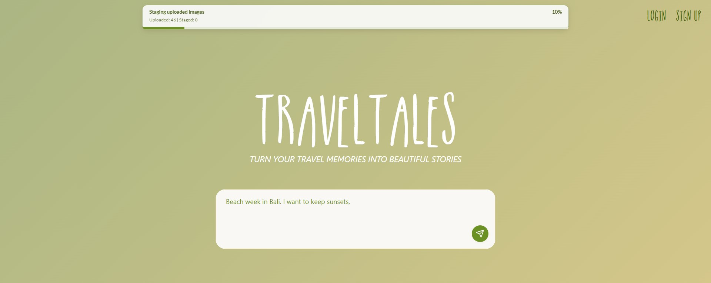
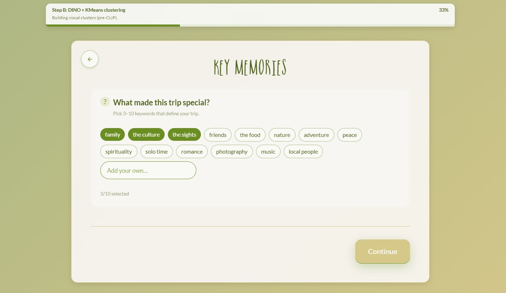
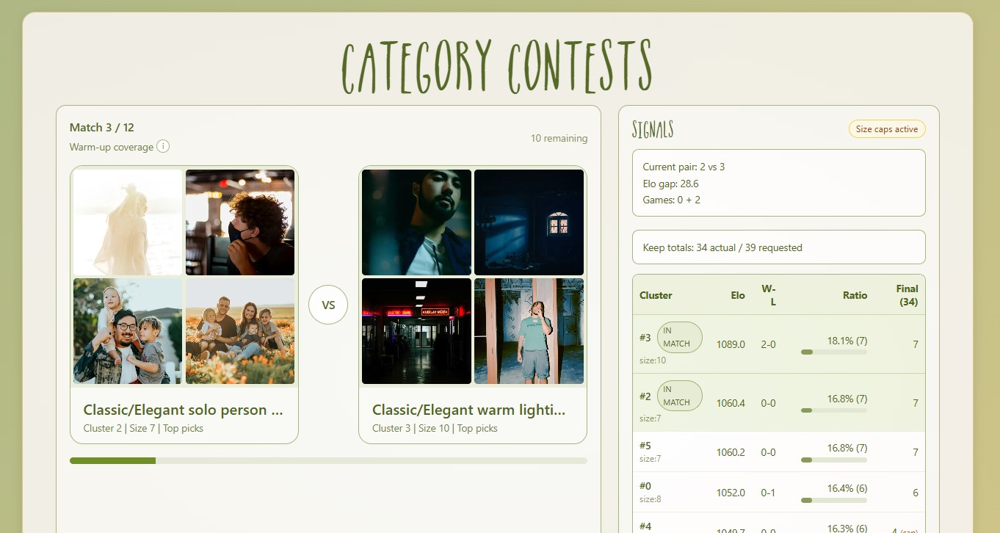

# TravelTales Photo Curation App

Turn a messy camera roll into a story-ready travel photo collection.

TravelTales is a full-stack app that combines:
- A polished onboarding + results UX (React/Vite/TypeScript)
- S3 or mock upload adapters
- Deterministic post-upload curation pipeline (FastAPI + vendored `pipeline_labs`)
- Interactive preference contests (Step C) to shape the final pool

## Product Preview

### Home Experience
The landing experience introduces the photobook journey and guides users into onboarding.



### Guided Onboarding
Onboarding captures trip context and mood preferences that later influence ranking.



### Step C Category Contests
Users choose between cluster composites to express taste, and those signals shape final allocation.



## Why this app exists

Travel albums are emotional, but manual curation is exhausting.  
TravelTales helps users quickly move from "200 random shots" to a curated photobook-ready set by blending:
- objective image quality + dedupe logic,
- visual clustering and mood-aware ranking,
- explicit user preference signals.

## Current Product Flow

1. `"/"` Pre-home uploader (`Drop your images`)
2. Background upload + universal progress bar
3. `"/home"` entry + onboarding flow
4. Step A runs in backend workspace (`dedupe + representative selection`)
5. Step B phase 1 runs (`DINO + KMeans`)
6. User picks 1-2 moods in onboarding
7. Step B phase 2 completes (`CLIP rerank + naming`)
8. `"/results/step-b"` clustered ranked results
9. `"/results/step-c"` category contests (Elo + ratios)
10. `"/results/final-pool"` accepted vs rejected by cluster

## Tech Stack

### Frontend
- React 18 + TypeScript + Vite
- Tailwind + shadcn/ui primitives
- React Router v6
- TanStack Query

### Backend
- FastAPI + Uvicorn
- Boto3 (S3)
- File-based workspace/job state (`server/workspaces/<albumId>/...`)

### Pipeline (vendored in-repo)
- `pipeline_labs.step_a.runner`
- `pipeline_labs.step_b.runner` (`dino_only` and `full` phases)

## Repository Layout

```text
app/
  src/                        # Frontend
  server/
    main.py                   # FastAPI entrypoint
    routes/
      post_upload.py          # Step A/B/C orchestration + assets + status
      processing.py           # Legacy processing route set
    workspaces/               # Runtime artifacts (gitignored)
  pipeline_labs/              # Vendored deterministic pipeline code
  docs/
    step_c_notes.md           # Step C tuning notes
```

## Environment Variables

Use a local `.env` in `app/`. Do not commit secrets.

### Frontend vars

| Variable | Required | Default | Notes |
|---|---:|---|---|
| `VITE_API_BASE_URL` | Yes for real backend | `""` | Usually `http://127.0.0.1:8000` |
| `VITE_UPLOAD_MODE` | No | `mock` | `mock` or `s3` |
| `VITE_DEMO_RESULTS` | No | `1` | Set `0` to disable demo result pages/panel |
| `VITE_UPLOAD_DEBUG` | No | `false` | Upload debug logging |
| `VITE_DEBUG_PROCESSING` | No | `0` | Legacy processing debug UI logs |
| `VITE_DEBUG_INTENT` | No | `0` | Onboarding intent debug logs |
| `VITE_SUPABASE_URL` | Optional | `""` | Needed if using Supabase auth flow |
| `VITE_SUPABASE_ANON_KEY` | Optional | `""` | Needed if using Supabase auth flow |

### Backend vars

| Variable | Required for S3 mode | Notes |
|---|---:|---|
| `AWS_ACCESS_KEY_ID` | Yes | S3 credentials |
| `AWS_SECRET_ACCESS_KEY` | Yes | S3 credentials |
| `AWS_S3_BUCKET` | Yes | Upload + staging bucket |
| `AWS_DEFAULT_REGION` | Recommended | Defaults to `us-east-1` |
| `AWS_S3_ENDPOINT` | Optional | For LocalStack/MinIO |
| `MOCK_S3` | Optional | Force backend mock behavior in helpers |
| `PIPELINE_DEBUG` | Optional | Verbose pipeline/job logs |
| `PIPELINE_ENABLED` | Optional | Legacy `/processing/*` path toggle |

## Local Setup

## 1) Frontend install

```bash
npm install
```

## 2) Backend Python env

```bash
python -m venv .venv
# Windows PowerShell
.venv\Scripts\Activate.ps1
# macOS/Linux
# source .venv/bin/activate

pip install -r server/requirements.txt
```

### Pipeline dependencies (required for Step A/Step B execution)

Install these in the same Python env:

```bash
pip install numpy pillow scikit-learn opencv-python imagehash scikit-image
pip install transformers torch torchvision open-clip-torch
```

Notes:
- Step B model weights download on first run.
- CPU-only runs are supported but slower.

## 3) Run backend (from `app/` root)

```bash
python -m uvicorn server.main:app --reload --host 127.0.0.1 --port 8000
```

## 4) Run frontend (from `app/` root)

```bash
npm run dev
```

Open the Vite URL shown in terminal (usually `http://127.0.0.1:5173`).

## Upload Modes

- `VITE_UPLOAD_MODE=mock`: frontend uses in-memory mock adapter (no real S3 transfer).
- `VITE_UPLOAD_MODE=s3`: frontend uses backend multipart endpoints and real S3 flow.

If you want real uploads, use:

```env
VITE_UPLOAD_MODE=s3
VITE_API_BASE_URL=http://127.0.0.1:8000
```

## Core API Surface (Current Flow)

### Upload + manifest
- `POST /albums`
- `POST /upload/manifest`
- `POST /upload/multipart/init`
- `GET /upload/multipart/part-url`
- `POST /upload/multipart/complete`

### Post-upload pipeline
- `POST /processing/post-upload/start`
- `POST /processing/post-upload/moods`
- `GET /processing/post-upload/status`
- `GET /processing/post-upload/step-a/list`
- `GET /processing/post-upload/step-b/clusters`
- `GET /processing/post-upload/step-b/images`
- `GET /processing/post-upload/step-c/state`
- `POST /processing/post-upload/step-c/choose`
- `GET /processing/post-upload/asset`

### Legacy route family (kept for compatibility/debug)
- `/processing/start`
- `/processing/status`

## Determinism Guarantees (Implemented)

- Stable staging order (`(s3_key, name)` sorted) before Step A input materialization
- Deterministic filenames for staged inputs (`000001__...`)
- Stable scan/sort behavior in Step A and Step B
- Fixed KMeans parameters (`random_state=0`, explicit `n_init`)
- Explicit tie-breakers (`path` ascending where needed)
- Step C deterministic pair selection tie-breaks by cluster id
- Persisted workspace artifacts per album to support replay/debug

## Workspace Artifacts

For each album:

```text
server/workspaces/<albumId>/
  inputs/
  inputs_manifest.json
  logs/
    step_a.log
    step_b.log
  step_a/
    quality.jsonl
    dedupe.jsonl
    step_a_manifest.jsonl
    reduced_pool/
    alternates/
  step_b/
    step_b_kmeans.jsonl
    step_b_kmeans_clusters.jsonl
    step_b_images.jsonl
    step_b_clusters.jsonl
    cache/
  step_c/
    state.json
  post_upload_status.json
```

`server/workspaces/` is runtime output and should stay gitignored.

## Demo/Debug Surfaces

- Step B page includes a DEMO outputs panel (toggleable)
- DEMO pages:
  - `/results/step-a`
  - `/results/dino-only`
  - `/results/clip-naming`
- Toggle: `VITE_DEMO_RESULTS=0` hides demo panel/routes.

## Troubleshooting

### `HeadObject 404 Not Found` during staging

Most common cause: uploaded keys are not present in the configured S3 bucket/base.

Check:
- `VITE_UPLOAD_MODE` matches intended adapter (`s3` vs `mock`)
- `VITE_API_BASE_URL` points to running backend
- backend AWS credentials/bucket/region are correct
- uploaded key in `sessionStorage.lastUpload.files` exists in bucket

### Upload starts but processing never begins

Check:
- backend is running on the same `VITE_API_BASE_URL`
- `/processing/post-upload/start` is reachable
- `sessionStorage.lastUpload` contains `albumId` and `files` keys

### Step B fails with model import errors

Install missing Python deps (`transformers`, `torch`, `open-clip-torch`, etc.) in backend venv.

## Build

```bash
npm run build
```

## Product Tone

TravelTales is intentionally practical and playful: serious curation quality for people who still want the joy of reliving the trip.
